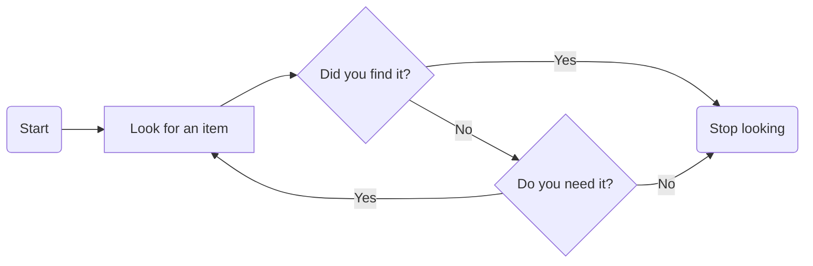

## ETL 簡介
ETL（Extract、Transform、Load）通常是一個專案的起頭  
也是一段需要花時間設計思考的過程  
根據這三個單字即分成三步驟做資料的萃取、轉換、載回
* Extract 的工具很多，常見用 SQL 做實現（[安裝範例或 python 銜接詳情](https://github.com/yuning-lin/EnvironmentSetup/tree/main/MySQL)） 
* Transform 是將資料做清洗、轉換讓資料利於後續分析所用
* Load 將整理好的數存載回目標存儲處（EX：資料庫、資料湖等）
## Transform
Extract、Load 可能使用工具類似，故著重在 Transform  
下列將常見手法由易至難列出：
* 去重複值
* 填補遺漏值
* 清除錯誤資訊
* 資料簡易轉換（如：編碼、dummy variable 等）
* 欄位間加減乘除
* 繁複的商業價值函式計算
* 其他更複雜運算的特徵工程
## 特徵工程（Feature Engineering）
根據資料型態、分析方式有不同的處理手法  
### 時間序列資料（Time Series）

* 傳統統計模型（單維度不做特徵工程）
* 機器學習模型（圍繞著可以凸顯時序資料成分的手法做生成）  

類別|說明|舉例
----|----|----
時間序列資料特性|遲延 N 期數|資料以周為週期，過去第 7 點的資訊即是很好的參考值
時間序列資料特性|遲延 N 期數 rolling（time window with statistics：mean, var, max…）|過往 30 天的銷售平均，即代表近一個月的銷售水平（給近期摘要的概念）
時間序列資料特性|遲延 N 期數 expanding（time window with statistics：mean, var, max…）|過去所有整體銷售最大值（可以持續追蹤資料的界限）
時間序列資料特性|遲延 N 期數 change|不同時點間的變化，如差分（速度）、差分的差分（加速度）、bias（乖離率）
時間單位編碼|秒、分、時、天、周、月、季、年，有特殊循環模式|在暑假銷售較好，加入月份（1,2,3,...,12）做為變數
虛擬變數|無法單純用時間單位表示的特殊事件|聖誕節、過年、機器換機時間等可以用 0、1 表示
其他相關時序資料|高相關的互補、替代性數據|競品銷售量、類似機種銷售量在同樣時間戳記的值
其他演算法應用|其他演算法對資料的預測、殘差|利用 ARIMA、Holt Winter 預測同一時序資料的殘差（注意可能會因有模型誤差而降低機器學習模型的穩定性）

