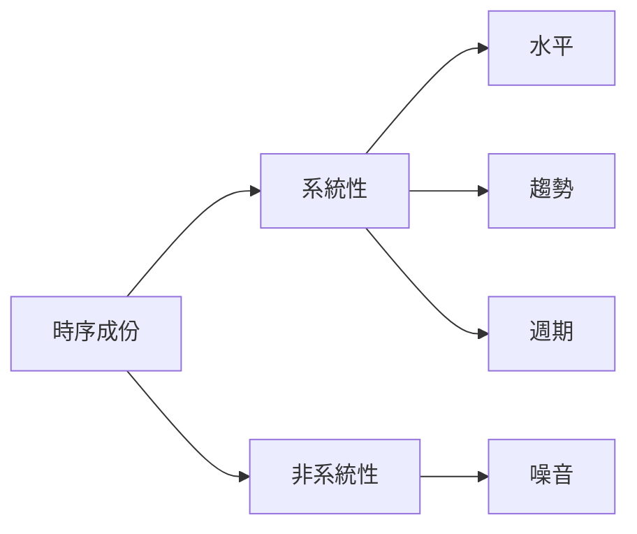

## ETL 簡介
ETL（Extract、Transform、Load）通常是一個專案的起頭  
也是一段需要花時間設計思考的過程  
根據這三個單字即分成三步驟做資料的萃取、轉換、載回
* Extract 的工具很多，常見用 SQL 做實現（[安裝範例或 python 銜接詳情](https://github.com/yuning-lin/EnvironmentSetup/tree/main/MySQL)） 
* Transform 是將資料做清洗、轉換讓資料利於後續分析所用
* Load 將整理好的數存載回目標存儲處（EX：資料庫、資料湖等）
## Transform
Extract、Load 可能使用工具類似，故著重在 Transform  
下列將常見手法由易至難列出：
* 去重複值
* 填補遺漏值
* 清除錯誤資訊
* 資料簡易轉換（如：編碼、dummy variable 等）
* 欄位間加減乘除
* 繁複的商業價值函式計算
* 其他更複雜運算的特徵工程
## 特徵工程（Feature Engineering）
根據資料型態、分析方式有不同的處理手法  
### 類別型資料
* label encoding（大小順序沒有意義的編碼）  

班別| |編碼
:--:|:--:|:--:
A| ＞ |0
B| ＞ |1
A| ＞ |0
C| ＞ |2
* one hot encoding（不帶大小數字的編碼，但要小心若有很多類別，遇到要求反矩陣的演算法可能會求不出）  

<table class="MsoTableGrid" border="1" cellspacing="0" cellpadding="0" width="0" style="width:414.95pt;border-collapse:collapse;border:none;mso-border-alt:
 solid windowtext .5pt;mso-yfti-tbllook:1184;mso-padding-alt:0cm 5.4pt 0cm 5.4pt">
 <tbody><tr style="mso-yfti-irow:0;mso-yfti-firstrow:yes">
  <td width="111" valign="top" style="width:82.95pt;border:solid windowtext 1.0pt;
  mso-border-alt:solid windowtext .5pt;padding:0cm 5.4pt 0cm 5.4pt">
  
班別

  </td>
  <td width="111" valign="top" style="width:83.0pt;border:none;border-right:solid windowtext 1.0pt;
  mso-border-left-alt:solid windowtext .5pt;mso-border-left-alt:solid windowtext .5pt;
  mso-border-right-alt:solid windowtext .5pt;padding:0cm 5.4pt 0cm 5.4pt">
  
<o:p>&nbsp;</o:p>

  </td>
  <td width="332" colspan="3" valign="top" style="width:249.0pt;border:solid windowtext 1.0pt;
  border-left:none;mso-border-left-alt:solid windowtext .5pt;mso-border-alt:
  solid windowtext .5pt;padding:0cm 5.4pt 0cm 5.4pt">
  
編碼

  </td>
 </tr>
 <tr style="mso-yfti-irow:1">
  <td width="111" valign="top" style="width:82.95pt;border:none;border-bottom:solid windowtext 1.0pt;
  mso-border-top-alt:solid windowtext .5pt;mso-border-top-alt:solid windowtext .5pt;
  mso-border-bottom-alt:solid windowtext .5pt;padding:0cm 5.4pt 0cm 5.4pt">
  
<o:p>&nbsp;</o:p>

  </td>
  <td width="111" valign="top" style="width:83.0pt;border:none;border-right:solid windowtext 1.0pt;
  mso-border-right-alt:solid windowtext .5pt;padding:0cm 5.4pt 0cm 5.4pt">
  
<o:p>&nbsp;</o:p>

  </td>
  <td width="111" valign="top" style="width:83.0pt;border-top:none;border-left:
  none;border-bottom:solid windowtext 1.0pt;border-right:solid windowtext 1.0pt;
  mso-border-top-alt:solid windowtext .5pt;mso-border-left-alt:solid windowtext .5pt;
  mso-border-alt:solid windowtext .5pt;padding:0cm 5.4pt 0cm 5.4pt">
  
A<o:p></o:p>

  </td>
  <td width="111" valign="top" style="width:83.0pt;border:solid windowtext 1.0pt;
  border-left:none;mso-border-left-alt:solid windowtext .5pt;mso-border-alt:
  solid windowtext .5pt;padding:0cm 5.4pt 0cm 5.4pt">
  
B<o:p></o:p>

  </td>
  <td width="111" valign="top" style="width:83.0pt;border:solid windowtext 1.0pt;
  border-left:none;mso-border-left-alt:solid windowtext .5pt;mso-border-alt:
  solid windowtext .5pt;padding:0cm 5.4pt 0cm 5.4pt">
  
C<o:p></o:p>

  </td>
 </tr>
 <tr style="mso-yfti-irow:2">
  <td width="111" valign="top" style="width:82.95pt;border:solid windowtext 1.0pt;
  border-top:none;mso-border-top-alt:solid windowtext .5pt;mso-border-alt:solid windowtext .5pt;
  padding:0cm 5.4pt 0cm 5.4pt">
  
A

  </td>
  <td width="111" valign="top" style="width:83.0pt;border:none;border-right:solid windowtext 1.0pt;
  mso-border-left-alt:solid windowtext .5pt;mso-border-left-alt:solid windowtext .5pt;
  mso-border-right-alt:solid windowtext .5pt;padding:0cm 5.4pt 0cm 5.4pt">
  
＞<o:p></o:p>

  </td>
  <td width="111" valign="top" style="width:83.0pt;border-top:none;border-left:
  none;border-bottom:solid windowtext 1.0pt;border-right:solid windowtext 1.0pt;
  mso-border-top-alt:solid windowtext .5pt;mso-border-left-alt:solid windowtext .5pt;
  mso-border-alt:solid windowtext .5pt;padding:0cm 5.4pt 0cm 5.4pt">
  
1<o:p></o:p>

  </td>
  <td width="111" valign="top" style="width:83.0pt;border-top:none;border-left:
  none;border-bottom:solid windowtext 1.0pt;border-right:solid windowtext 1.0pt;
  mso-border-top-alt:solid windowtext .5pt;mso-border-left-alt:solid windowtext .5pt;
  mso-border-alt:solid windowtext .5pt;padding:0cm 5.4pt 0cm 5.4pt">
  
0<o:p></o:p>

  </td>
  <td width="111" valign="top" style="width:83.0pt;border-top:none;border-left:
  none;border-bottom:solid windowtext 1.0pt;border-right:solid windowtext 1.0pt;
  mso-border-top-alt:solid windowtext .5pt;mso-border-left-alt:solid windowtext .5pt;
  mso-border-alt:solid windowtext .5pt;padding:0cm 5.4pt 0cm 5.4pt">
  
0<o:p></o:p>

  </td>
 </tr>
 <tr style="mso-yfti-irow:3">
  <td width="111" valign="top" style="width:82.95pt;border:solid windowtext 1.0pt;
  border-top:none;mso-border-top-alt:solid windowtext .5pt;mso-border-alt:solid windowtext .5pt;
  padding:0cm 5.4pt 0cm 5.4pt">
  
B

  </td>
  <td width="111" valign="top" style="width:83.0pt;border:none;border-right:solid windowtext 1.0pt;
  mso-border-left-alt:solid windowtext .5pt;mso-border-left-alt:solid windowtext .5pt;
  mso-border-right-alt:solid windowtext .5pt;padding:0cm 5.4pt 0cm 5.4pt">
  
＞

  </td>
  <td width="111" valign="top" style="width:83.0pt;border-top:none;border-left:
  none;border-bottom:solid windowtext 1.0pt;border-right:solid windowtext 1.0pt;
  mso-border-top-alt:solid windowtext .5pt;mso-border-left-alt:solid windowtext .5pt;
  mso-border-alt:solid windowtext .5pt;padding:0cm 5.4pt 0cm 5.4pt">
  
0<o:p></o:p>

  </td>
  <td width="111" valign="top" style="width:83.0pt;border-top:none;border-left:
  none;border-bottom:solid windowtext 1.0pt;border-right:solid windowtext 1.0pt;
  mso-border-top-alt:solid windowtext .5pt;mso-border-left-alt:solid windowtext .5pt;
  mso-border-alt:solid windowtext .5pt;padding:0cm 5.4pt 0cm 5.4pt">
  
1<o:p></o:p>

  </td>
  <td width="111" valign="top" style="width:83.0pt;border-top:none;border-left:
  none;border-bottom:solid windowtext 1.0pt;border-right:solid windowtext 1.0pt;
  mso-border-top-alt:solid windowtext .5pt;mso-border-left-alt:solid windowtext .5pt;
  mso-border-alt:solid windowtext .5pt;padding:0cm 5.4pt 0cm 5.4pt">
  
0<o:p></o:p>

  </td>
 </tr>
 <tr style="mso-yfti-irow:4">
  <td width="111" valign="top" style="width:82.95pt;border:solid windowtext 1.0pt;
  border-top:none;mso-border-top-alt:solid windowtext .5pt;mso-border-alt:solid windowtext .5pt;
  padding:0cm 5.4pt 0cm 5.4pt">
  
A

  </td>
  <td width="111" valign="top" style="width:83.0pt;border:none;border-right:solid windowtext 1.0pt;
  mso-border-left-alt:solid windowtext .5pt;mso-border-left-alt:solid windowtext .5pt;
  mso-border-right-alt:solid windowtext .5pt;padding:0cm 5.4pt 0cm 5.4pt">
  
＞

  </td>
  <td width="111" valign="top" style="width:83.0pt;border-top:none;border-left:
  none;border-bottom:solid windowtext 1.0pt;border-right:solid windowtext 1.0pt;
  mso-border-top-alt:solid windowtext .5pt;mso-border-left-alt:solid windowtext .5pt;
  mso-border-alt:solid windowtext .5pt;padding:0cm 5.4pt 0cm 5.4pt">
  
1<o:p></o:p>

  </td>
  <td width="111" valign="top" style="width:83.0pt;border-top:none;border-left:
  none;border-bottom:solid windowtext 1.0pt;border-right:solid windowtext 1.0pt;
  mso-border-top-alt:solid windowtext .5pt;mso-border-left-alt:solid windowtext .5pt;
  mso-border-alt:solid windowtext .5pt;padding:0cm 5.4pt 0cm 5.4pt">
  
0<o:p></o:p>

  </td>
  <td width="111" valign="top" style="width:83.0pt;border-top:none;border-left:
  none;border-bottom:solid windowtext 1.0pt;border-right:solid windowtext 1.0pt;
  mso-border-top-alt:solid windowtext .5pt;mso-border-left-alt:solid windowtext .5pt;
  mso-border-alt:solid windowtext .5pt;padding:0cm 5.4pt 0cm 5.4pt">
  
0<o:p></o:p>

  </td>
 </tr>
 <tr style="mso-yfti-irow:5;mso-yfti-lastrow:yes">
  <td width="111" valign="top" style="width:82.95pt;border:solid windowtext 1.0pt;
  border-top:none;mso-border-top-alt:solid windowtext .5pt;mso-border-alt:solid windowtext .5pt;
  padding:0cm 5.4pt 0cm 5.4pt">
  
C

  </td>
  <td width="111" valign="top" style="width:83.0pt;border:none;border-right:solid windowtext 1.0pt;
  mso-border-left-alt:solid windowtext .5pt;mso-border-left-alt:solid windowtext .5pt;
  mso-border-right-alt:solid windowtext .5pt;padding:0cm 5.4pt 0cm 5.4pt">
  
＞

  </td>
  <td width="111" valign="top" style="width:83.0pt;border-top:none;border-left:
  none;border-bottom:solid windowtext 1.0pt;border-right:solid windowtext 1.0pt;
  mso-border-top-alt:solid windowtext .5pt;mso-border-left-alt:solid windowtext .5pt;
  mso-border-alt:solid windowtext .5pt;padding:0cm 5.4pt 0cm 5.4pt">
  
0<o:p></o:p>

  </td>
  <td width="111" valign="top" style="width:83.0pt;border-top:none;border-left:
  none;border-bottom:solid windowtext 1.0pt;border-right:solid windowtext 1.0pt;
  mso-border-top-alt:solid windowtext .5pt;mso-border-left-alt:solid windowtext .5pt;
  mso-border-alt:solid windowtext .5pt;padding:0cm 5.4pt 0cm 5.4pt">
  
0<o:p></o:p>

  </td>
  <td width="111" valign="top" style="width:83.0pt;border-top:none;border-left:
  none;border-bottom:solid windowtext 1.0pt;border-right:solid windowtext 1.0pt;
  mso-border-top-alt:solid windowtext .5pt;mso-border-left-alt:solid windowtext .5pt;
  mso-border-alt:solid windowtext .5pt;padding:0cm 5.4pt 0cm 5.4pt">
  
1<o:p></o:p>

  </td>
 </tr>
</tbody></table>

* 數值編碼（將有順序關係的類別對映成數值做代表）

班別|成績|  |班平均（編碼）
:---:|:---:|---|:---:
A | 90| ＞ |92
B | 80| ＞ |80
A | 94| ＞ |92
C | 70| ＞ |70

### 非時序數值型資料
* 取對數（去偏態）
* 轉換成百分位值（限制範圍於一百內並且間距大小一致）
* 轉換成 PR 值（限制範圍於一百內並且間距大小不一致）
### 時間序列資料（Time Series）

* 傳統統計模型（單維度不做特徵工程）
* 機器學習模型（圍繞著可以凸顯時序資料成分的手法做生成）  

<table class=MsoTable15Grid5DarkAccent3 border=1 cellspacing=0 cellpadding=0
 style='border-collapse:collapse;border:none;mso-border-alt:solid white .5pt;
 mso-border-themecolor:background1;mso-yfti-tbllook:1184;mso-padding-alt:0cm 5.4pt 0cm 5.4pt'>
 <tr style='mso-yfti-irow:-1;mso-yfti-firstrow:yes;mso-yfti-lastfirstrow:yes'>
  <td width=170 valign=top style='width:113.15pt;border:solid white 1.0pt;
  mso-border-themecolor:background1;border-right:none;mso-border-top-alt:solid white .5pt;
  mso-border-top-themecolor:background1;mso-border-left-alt:solid white .5pt;
  mso-border-left-themecolor:background1;mso-border-bottom-alt:solid white .5pt;
  mso-border-bottom-themecolor:background1;background:#A5A5A5;mso-background-themecolor:
  accent3;padding:0cm 5.4pt 0cm 5.4pt'>
  
<b>類別<o:p></o:p></b>

  </td>
  <td width=300 valign=top style='width:212.65pt;border-top:solid white 1.0pt;
  mso-border-top-themecolor:background1;border-left:none;border-bottom:solid white 1.0pt;
  mso-border-bottom-themecolor:background1;border-right:none;mso-border-top-alt:
  solid white .5pt;mso-border-top-themecolor:background1;mso-border-bottom-alt:
  solid white .5pt;mso-border-bottom-themecolor:background1;background:#A5A5A5;
  mso-background-themecolor:accent3;padding:0cm 5.4pt 0cm 5.4pt'>
  
<b>說明<o:p></o:p></b>

  </td>
  <td width=550 valign=top style='width:13.0cm;border:solid white 1.0pt;
  mso-border-themecolor:background1;border-left:none;mso-border-top-alt:solid white .5pt;
  mso-border-top-themecolor:background1;mso-border-bottom-alt:solid white .5pt;
  mso-border-bottom-themecolor:background1;mso-border-right-alt:solid white .5pt;
  mso-border-right-themecolor:background1;background:#A5A5A5;mso-background-themecolor:
  accent3;padding:0cm 5.4pt 0cm 5.4pt'>
  
<b>舉例<o:p></o:p></b>

  </td>
 </tr>
 <tr style='mso-yfti-irow:0'>
  <td width=170 rowspan=4 valign=top style='width:113.15pt;border:solid white 1.0pt;
  mso-border-themecolor:background1;border-top:none;mso-border-top-alt:solid white .5pt;
  mso-border-top-themecolor:background1;mso-border-alt:solid white .5pt;
  mso-border-themecolor:background1;background:#A5A5A5;mso-background-themecolor:
  accent3;padding:0cm 5.4pt 0cm 5.4pt'>
  
<b>時間序列資料特性<o:p></o:p></b>

  
<b><o:p>&nbsp;</o:p></b>

  </td>
  <td width=300 valign=top style='width:212.65pt;border-top:none;border-left:
  none;border-bottom:solid white 1.0pt;mso-border-bottom-themecolor:background1;
  border-right:solid white 1.0pt;mso-border-right-themecolor:background1;
  mso-border-top-alt:solid white .5pt;mso-border-top-themecolor:background1;
  mso-border-left-alt:solid white .5pt;mso-border-left-themecolor:background1;
  mso-border-alt:solid white .5pt;mso-border-themecolor:background1;background:
  #DBDBDB;mso-background-themecolor:accent3;mso-background-themetint:102;
  padding:0cm 5.4pt 0cm 5.4pt'>
  
遲延 N 期數

  </td>
  <td width=550 valign=top style='width:13.0cm;border-top:none;border-left:
  none;border-bottom:solid white 1.0pt;mso-border-bottom-themecolor:background1;
  border-right:solid white 1.0pt;mso-border-right-themecolor:background1;
  mso-border-top-alt:solid white .5pt;mso-border-top-themecolor:background1;
  mso-border-left-alt:solid white .5pt;mso-border-left-themecolor:background1;
  mso-border-alt:solid white .5pt;mso-border-themecolor:background1;background:
  #DBDBDB;mso-background-themecolor:accent3;mso-background-themetint:102;
  padding:0cm 5.4pt 0cm 5.4pt'>
  
資料以周為週期，過去第 7 點的資訊即是很好的參考值

  </td>
 </tr>
 <tr style='mso-yfti-irow:1'>
  <td width=300 valign=top style='width:212.65pt;border-top:none;border-left:
  none;border-bottom:solid white 1.0pt;mso-border-bottom-themecolor:background1;
  border-right:solid white 1.0pt;mso-border-right-themecolor:background1;
  mso-border-top-alt:solid white .5pt;mso-border-top-themecolor:background1;
  mso-border-left-alt:solid white .5pt;mso-border-left-themecolor:background1;
  mso-border-alt:solid white .5pt;mso-border-themecolor:background1;background:
  #EDEDED;mso-background-themecolor:accent3;mso-background-themetint:51;
  padding:0cm 5.4pt 0cm 5.4pt'>
  
遲延 N 期數 rolling（time window
  with statistics：mean, var, max…）

  </td>
  <td width=550 valign=top style='width:13.0cm;border-top:none;border-left:
  none;border-bottom:solid white 1.0pt;mso-border-bottom-themecolor:background1;
  border-right:solid white 1.0pt;mso-border-right-themecolor:background1;
  mso-border-top-alt:solid white .5pt;mso-border-top-themecolor:background1;
  mso-border-left-alt:solid white .5pt;mso-border-left-themecolor:background1;
  mso-border-alt:solid white .5pt;mso-border-themecolor:background1;background:
  #EDEDED;mso-background-themecolor:accent3;mso-background-themetint:51;
  padding:0cm 5.4pt 0cm 5.4pt'>
  
過往 30 天的銷售平均，即代表近一個月的銷售水平（給近期摘要的概念）

  </td>
 </tr>
 <tr style='mso-yfti-irow:2'>
  <td width=300 valign=top style='width:212.65pt;border-top:none;border-left:
  none;border-bottom:solid white 1.0pt;mso-border-bottom-themecolor:background1;
  border-right:solid white 1.0pt;mso-border-right-themecolor:background1;
  mso-border-top-alt:solid white .5pt;mso-border-top-themecolor:background1;
  mso-border-left-alt:solid white .5pt;mso-border-left-themecolor:background1;
  mso-border-alt:solid white .5pt;mso-border-themecolor:background1;background:
  #DBDBDB;mso-background-themecolor:accent3;mso-background-themetint:102;
  padding:0cm 5.4pt 0cm 5.4pt'>
  
遲延 N 期數 expanding（time window
  with statistics：mean, var, max…）

  </td>
  <td width=550 valign=top style='width:13.0cm;border-top:none;border-left:
  none;border-bottom:solid white 1.0pt;mso-border-bottom-themecolor:background1;
  border-right:solid white 1.0pt;mso-border-right-themecolor:background1;
  mso-border-top-alt:solid white .5pt;mso-border-top-themecolor:background1;
  mso-border-left-alt:solid white .5pt;mso-border-left-themecolor:background1;
  mso-border-alt:solid white .5pt;mso-border-themecolor:background1;background:
  #DBDBDB;mso-background-themecolor:accent3;mso-background-themetint:102;
  padding:0cm 5.4pt 0cm 5.4pt'>
  
過去所有整體銷售最大值（可以持續追蹤資料的界限）

  </td>
 </tr>
 <tr style='mso-yfti-irow:3'>
  <td width=300 valign=top style='width:212.65pt;border-top:none;border-left:
  none;border-bottom:solid white 1.0pt;mso-border-bottom-themecolor:background1;
  border-right:solid white 1.0pt;mso-border-right-themecolor:background1;
  mso-border-top-alt:solid white .5pt;mso-border-top-themecolor:background1;
  mso-border-left-alt:solid white .5pt;mso-border-left-themecolor:background1;
  mso-border-alt:solid white .5pt;mso-border-themecolor:background1;background:
  #EDEDED;mso-background-themecolor:accent3;mso-background-themetint:51;
  padding:0cm 5.4pt 0cm 5.4pt'>
  
遲延 N 期數 change

  </td>
  <td width=550 valign=top style='width:13.0cm;border-top:none;border-left:
  none;border-bottom:solid white 1.0pt;mso-border-bottom-themecolor:background1;
  border-right:solid white 1.0pt;mso-border-right-themecolor:background1;
  mso-border-top-alt:solid white .5pt;mso-border-top-themecolor:background1;
  mso-border-left-alt:solid white .5pt;mso-border-left-themecolor:background1;
  mso-border-alt:solid white .5pt;mso-border-themecolor:background1;background:
  #EDEDED;mso-background-themecolor:accent3;mso-background-themetint:51;
  padding:0cm 5.4pt 0cm 5.4pt'>
  
不同時點間的變化，如差分（速度）、差分的差分（加速度）、bias（乖離率）

  </td>
 </tr>
 <tr style='mso-yfti-irow:4'>
  <td width=170 valign=top style='width:113.15pt;border:solid white 1.0pt;
  mso-border-themecolor:background1;border-top:none;mso-border-top-alt:solid white .5pt;
  mso-border-top-themecolor:background1;mso-border-alt:solid white .5pt;
  mso-border-themecolor:background1;background:#A5A5A5;mso-background-themecolor:
  accent3;padding:0cm 5.4pt 0cm 5.4pt'>
  
<b>時間單位編碼<o:p></o:p></b>

  </td>
  <td width=300 valign=top style='width:212.65pt;border-top:none;border-left:
  none;border-bottom:solid white 1.0pt;mso-border-bottom-themecolor:background1;
  border-right:solid white 1.0pt;mso-border-right-themecolor:background1;
  mso-border-top-alt:solid white .5pt;mso-border-top-themecolor:background1;
  mso-border-left-alt:solid white .5pt;mso-border-left-themecolor:background1;
  mso-border-alt:solid white .5pt;mso-border-themecolor:background1;background:
  #DBDBDB;mso-background-themecolor:accent3;mso-background-themetint:102;
  padding:0cm 5.4pt 0cm 5.4pt'>
  
秒、分、時、天、周、月、季、年，有特殊循環模式

  </td>
  <td width=550 valign=top style='width:13.0cm;border-top:none;border-left:
  none;border-bottom:solid white 1.0pt;mso-border-bottom-themecolor:background1;
  border-right:solid white 1.0pt;mso-border-right-themecolor:background1;
  mso-border-top-alt:solid white .5pt;mso-border-top-themecolor:background1;
  mso-border-left-alt:solid white .5pt;mso-border-left-themecolor:background1;
  mso-border-alt:solid white .5pt;mso-border-themecolor:background1;background:
  #DBDBDB;mso-background-themecolor:accent3;mso-background-themetint:102;
  padding:0cm 5.4pt 0cm 5.4pt'>
  
在暑假銷售較好，加入月份（1,2,3,...,12）做為變數

  </td>
 </tr>
 <tr style='mso-yfti-irow:5'>
  <td width=170 valign=top style='width:113.15pt;border:solid white 1.0pt;
  mso-border-themecolor:background1;border-top:none;mso-border-top-alt:solid white .5pt;
  mso-border-top-themecolor:background1;mso-border-alt:solid white .5pt;
  mso-border-themecolor:background1;background:#A5A5A5;mso-background-themecolor:
  accent3;padding:0cm 5.4pt 0cm 5.4pt'>
  
<b>虛擬變數<o:p></o:p></b>

  
<b>&nbsp;<o:p></o:p></b>

  </td>
  <td width=300 valign=top style='width:212.65pt;border-top:none;border-left:
  none;border-bottom:solid white 1.0pt;mso-border-bottom-themecolor:background1;
  border-right:solid white 1.0pt;mso-border-right-themecolor:background1;
  mso-border-top-alt:solid white .5pt;mso-border-top-themecolor:background1;
  mso-border-left-alt:solid white .5pt;mso-border-left-themecolor:background1;
  mso-border-alt:solid white .5pt;mso-border-themecolor:background1;background:
  #EDEDED;mso-background-themecolor:accent3;mso-background-themetint:51;
  padding:0cm 5.4pt 0cm 5.4pt'>
  
無法單純用時間單位表示的特殊事件

  </td>
  <td width=550 valign=top style='width:13.0cm;border-top:none;border-left:
  none;border-bottom:solid white 1.0pt;mso-border-bottom-themecolor:background1;
  border-right:solid white 1.0pt;mso-border-right-themecolor:background1;
  mso-border-top-alt:solid white .5pt;mso-border-top-themecolor:background1;
  mso-border-left-alt:solid white .5pt;mso-border-left-themecolor:background1;
  mso-border-alt:solid white .5pt;mso-border-themecolor:background1;background:
  #EDEDED;mso-background-themecolor:accent3;mso-background-themetint:51;
  padding:0cm 5.4pt 0cm 5.4pt'>
  
聖誕節、過年、機器換機時間等可以用 0、1 表示

  </td>
 </tr>
 <tr style='mso-yfti-irow:6'>
  <td width=170 valign=top style='width:113.15pt;border:solid white 1.0pt;
  mso-border-themecolor:background1;border-top:none;mso-border-top-alt:solid white .5pt;
  mso-border-top-themecolor:background1;mso-border-alt:solid white .5pt;
  mso-border-themecolor:background1;background:#A5A5A5;mso-background-themecolor:
  accent3;padding:0cm 5.4pt 0cm 5.4pt'>
  
<b>其他相關時序資料<o:p></o:p></b>

  </td>
  <td width=300 valign=top style='width:212.65pt;border-top:none;border-left:
  none;border-bottom:solid white 1.0pt;mso-border-bottom-themecolor:background1;
  border-right:solid white 1.0pt;mso-border-right-themecolor:background1;
  mso-border-top-alt:solid white .5pt;mso-border-top-themecolor:background1;
  mso-border-left-alt:solid white .5pt;mso-border-left-themecolor:background1;
  mso-border-alt:solid white .5pt;mso-border-themecolor:background1;background:
  #DBDBDB;mso-background-themecolor:accent3;mso-background-themetint:102;
  padding:0cm 5.4pt 0cm 5.4pt'>
  
高相關的互補、替代性數據

  </td>
  <td width=550 valign=top style='width:13.0cm;border-top:none;border-left:
  none;border-bottom:solid white 1.0pt;mso-border-bottom-themecolor:background1;
  border-right:solid white 1.0pt;mso-border-right-themecolor:background1;
  mso-border-top-alt:solid white .5pt;mso-border-top-themecolor:background1;
  mso-border-left-alt:solid white .5pt;mso-border-left-themecolor:background1;
  mso-border-alt:solid white .5pt;mso-border-themecolor:background1;background:
  #DBDBDB;mso-background-themecolor:accent3;mso-background-themetint:102;
  padding:0cm 5.4pt 0cm 5.4pt'>
  
競品銷售量、類似機種銷售量在同樣時間戳記的值

  </td>
 </tr>
 <tr style='mso-yfti-irow:7;mso-yfti-lastrow:yes'>
  <td width=170 valign=top style='width:113.15pt;border:solid white 1.0pt;
  mso-border-themecolor:background1;border-top:none;mso-border-top-alt:solid white .5pt;
  mso-border-top-themecolor:background1;mso-border-alt:solid white .5pt;
  mso-border-themecolor:background1;background:#A5A5A5;mso-background-themecolor:
  accent3;padding:0cm 5.4pt 0cm 5.4pt'>
  
<b>其他演算法應用<o:p></o:p></b>

  </td>
  <td width=300 valign=top style='width:212.65pt;border-top:none;border-left:
  none;border-bottom:solid white 1.0pt;mso-border-bottom-themecolor:background1;
  border-right:solid white 1.0pt;mso-border-right-themecolor:background1;
  mso-border-top-alt:solid white .5pt;mso-border-top-themecolor:background1;
  mso-border-left-alt:solid white .5pt;mso-border-left-themecolor:background1;
  mso-border-alt:solid white .5pt;mso-border-themecolor:background1;background:
  #EDEDED;mso-background-themecolor:accent3;mso-background-themetint:51;
  padding:0cm 5.4pt 0cm 5.4pt'>
  
其他演算法對資料的預測、殘差

  </td>
  <td width=550 valign=top style='width:13.0cm;border-top:none;border-left:
  none;border-bottom:solid white 1.0pt;mso-border-bottom-themecolor:background1;
  border-right:solid white 1.0pt;mso-border-right-themecolor:background1;
  mso-border-top-alt:solid white .5pt;mso-border-top-themecolor:background1;
  mso-border-left-alt:solid white .5pt;mso-border-left-themecolor:background1;
  mso-border-alt:solid white .5pt;mso-border-themecolor:background1;background:
  #EDEDED;mso-background-themecolor:accent3;mso-background-themetint:51;
  padding:0cm 5.4pt 0cm 5.4pt'>
  
利用 ARIMA、Holt Winter 預測同一時序資料的殘差（注意可能會因有模型誤差而降低機器學習模型的穩定性）

  </td>
 </tr>
</table>

## 參考來源
* [Basic Feature Engineering With Time Series Data in Python](https://machinelearningmastery.com/basic-feature-engineering-time-series-data-python/)
* [機器學習的時間序列特徵工程](https://medium.com/@folderplus/%E6%A9%9F%E5%99%A8%E5%AD%B8%E7%BF%92%E7%9A%84%E6%99%82%E9%96%93%E5%BA%8F%E5%88%97%E7%89%B9%E5%BE%B5%E5%B7%A5%E7%A8%8B-8ec54cd6b93f)
* [特徵工程-資料類型處理](https://ithelp.ithome.com.tw/articles/10219949?sc=hot)
