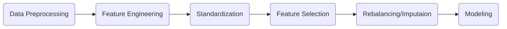
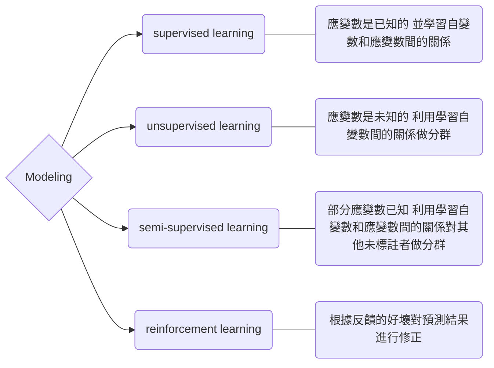

## 簡介
通常是數據分析的最後一步  
能否穩健還是仰賴預處理、特徵工程等工作  
下列列出可能會執行的步驟供參考  

## 常見標準化方式（Standardization）

python 套件|公式|規範範圍|適用情境
---|---|---|---
`scale` `StandardScaler`|$\frac{x_i-\mu}{\sigma}$|大部分介於 [-3,3]|不改變原始分布、讓不同量級分布的變數可一起比較
`RobustScaler`|$\frac{x_i-median(x_i)}{IQR}$|大部分介於 [-3,3]|改善離群值的影響，不改變原始分布、讓不同量級分布的變數可一起比較
`MinMaxScaler`|$\frac{x_i-x_min}{x_max-x_min}$|介於 [0,1]|改變原始分布、提高迭代求解速度
`MaxAbsScaler`|$\frac{x_i}{max(abs(x_i))}$|介於 [-1,1]|改變原始分布、提高迭代求解速度

### python 相關套件
```
from sklearn.preprocessing import scale, StandardScaler, RobustScaler, MinMaxScaler, MaxAbsScaler
```

## 常見不平衡資料（Class Imbalance）處理方式
### 方法由簡至易列出：
* Penalize Algorithms：利用嚴重懲罰少數類預測錯誤來調整資料平衡
* Threshold-moving：利用 grid search 找出最佳閾值以修正樣本偏斜
  * ROC curve with G-mean
  * Precision-Recall curve with F-score 
* Rebalancing：利用增減樣本來達到資料平衡
  * undersampling：移除資料達資料平衡
    * Random
    * Tomek links
    * NearMiss
  * oversampling：添加資料達資料平衡
    * Random
    * SMOTE（Synthetic Minority Oversampling Technique）  
  
      
  方法|適用情境|優點|缺點
  ---|---|---|---
  undersampling|訓練集量大|改善運行時間、存儲問題|可能丟失潛在有用訊息、採到偏樣本
  oversampling|訓練集量少|訊息不會丟失|易過擬合

### python 相關套件
方法|套件
---|---
Threshold-moving|from sklearn.metrics import roc_curve, precision_recall_curve
Rebalancing|import imblearn

## 常見補值（Imputaion）方法

* Non-time-series method
  * Statistics Imputaion：平均值、中位數、眾數做補值
  * Random sample imputation：隨機抽樣做補值
  
* Time-series method
  * 基於統計學的補值方式：
    * 缺少考慮季節性訊息：
      * Neighborhood：鄰近點做補值，EX：前後點
      * Linear interpolation：配適線性迴歸模型來預測補遺漏值
      * Moving Average：利用移動平均做補值
    * 考慮季節性訊息：
      * 同一季節做線性插補
      * 配適時序模型做預測補值

  * 基於機器學習的補值方式：缺少考慮相鄰時間點訊息
    * KNN（k-nearest neighbor）
    * RNN（recurrent neural networks）
    * EM（expectation-maximization）
    * 矩陣分解（matrix factorization）

  
## 常見機器學習分類

